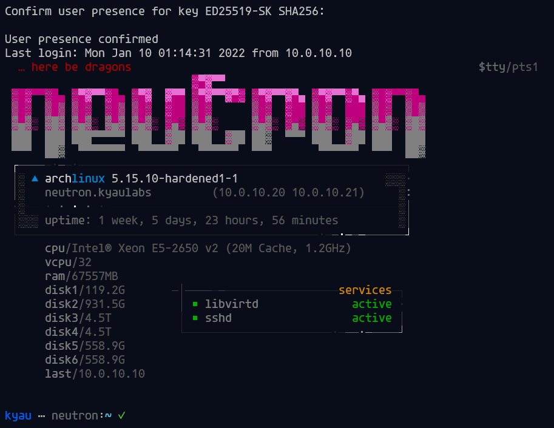
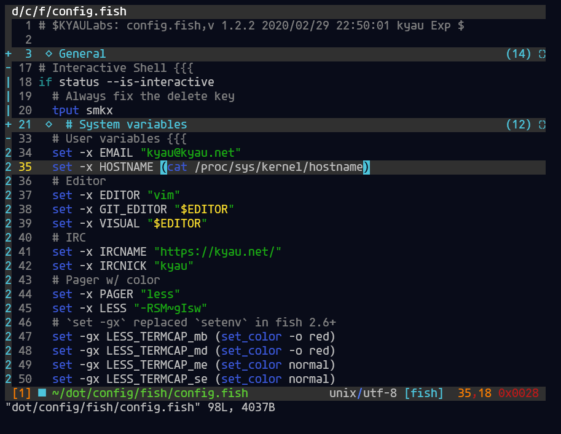

# dotfiles
[https://kyau.net/](https://kyau.net/)

[](CODE_OF_CONDUCT.md) &nbsp; [](LICENSE) &nbsp; [](https://github.com/zricethezav/gitleaks) &nbsp; [](https://github.com/kyau/dotfiles/actions) &nbsp; [](https://discord.gg/DSvUNYm)

* [About](#about)
* [Usage](#usage)
* [Screenshots](#screenshots)
* [Attribution](#attribution)

## About
*"Simplicity is the ultimate sophistication." - Leonardo da Vinci*

These are the dotfiles that I use while running Arch Linux on my desktop and laptop. Originally to keep a backup that was easily accessible. I have since added tools to automate the process of installing all of the default packages I use and setting up the proper symbolic links for all of the files in this repository. If one were to use these files, it is highly recommended you fork the repository and thoroughly look over its contents to make sure all of the settings are to your liking. Many will need to be changed as they are setup with my own personal information.

## Usage
```
Usage: ./dotme [OPTION]...
Initiate the user environment. Does nothing with no OPTION.
  -i            install user packages (.pkg-<profile>)
  -p <profile>  user environment profile
  -t            debug mode: runs tests, informational only does not do anything
  -x            include Xorg apps/configs (applies to -i and -s)
  -h            display this help and exit
```

## Screenshots




## Attribution
* [Agave](https://github.com/blobject/agave) - Agave, current font
* [Starship](https://starship.rs/) - customizable cross-shell prompt
* [http://bohoomil.deviantart.com/](http://bohoomil.deviantart.com/) - Xresources color scheme modified from Euphrasia (link broken)
* [nvie/vimrc](https://github.com/nvie/vimrc) - inspiration, documentation & some config portions
* [The ultimate Vim configuration](https://web.archive.org/web/20170222115910/http://amix.dk/vim/vimrc.html) - inspiration and some config parts
